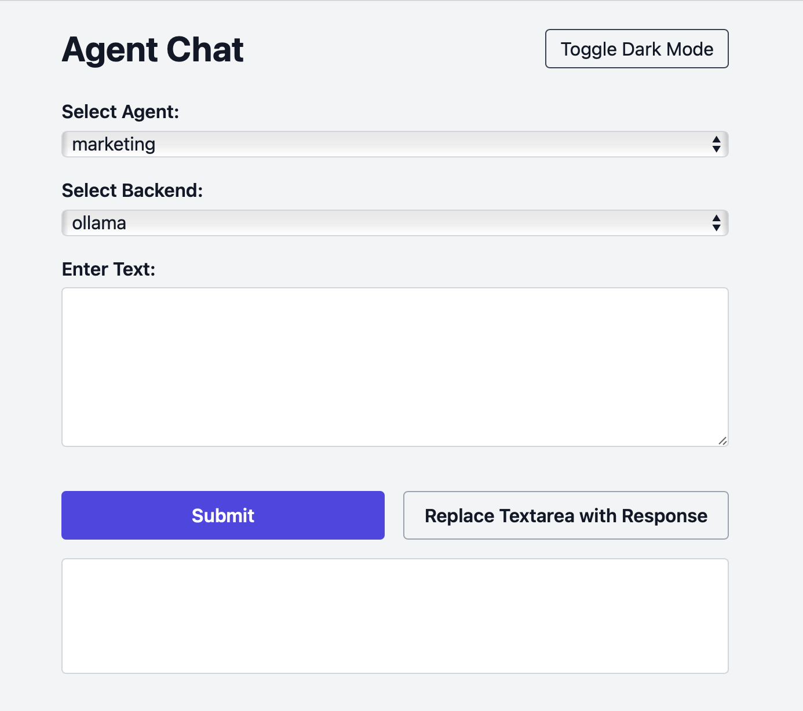

# Cerveau

A minimalist one-page application enabling chat interactions with AI agents.

## Prerequisites

- [Optional] ChatGPT API Key
- [Optional] Ollama Endpoint
- A model (I tested `phi4` and `gpt-4`)
- Custom Agent(s) - See `agents/` for the structure.

## Local

```bash
deno run --allow-net --allow-env --env-file --allow-write --allow-read --watch mod.ts
```

## Docker

```bash
docker build -t cerveau-server -f Dockerfile .
docker run -it --rm --name cerveau-server -p 8002:8002 --env-file .env -v ./output:/application/output/ cerveau-server:latest
```

## Screenshot


